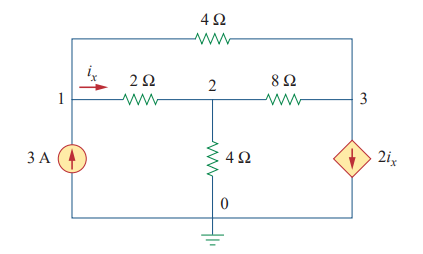

# tauSPICE
A SPICE based circuit simulator made with Matlab.

# Description
tauSPICE can perform both Steady state and tranient analysis. Currently the library has the following components:
* Capacitor (C)
* Current controlled current source (F)
* Current controlled voltage source (H)
* DC current source (IDC)
* Sinusoidal current source (ISIN)
* Inductor (L)
* Resistor (R)
* Short circuit (SC)
* Switch (UTCLOSE)
* Voltage controlled current source (G)
* Voltage controlled voltage source (E)
* DC voltage source (VDC)
* Sinusoidal voltage source (VSIN)

The library can be extended to have more elements by adding more elements in the lib folder.  

# Example Circuits
Circuit:  

Textbook soltuion of Vo:  

Netlist input:   
<code>["V1 1 0 DC 7";  
    "R1 1 2 3";  
    "L1 2 3 0.5";  
    "R2 3 0 1";  
    "L2 3 0 0.20";  
    ".TRA 0 1.5 .01"]
</code>

Transient solution of tauSPICE:  

<b>Circuit diagram:</b>
  

Netlist:  
<code>
["Vac 1 0 SIN 20 0.6366 0";
    "R1 1 2 10";
    "C1 4 0 0.1";
    "Vd 2 4 DC 0";
    "L1 2 3 1";
    "F1 0 3 Vd 2";
    "L1 0 3 0.5";
    ".SSA"];
</code>

Steady state complex solution matrix from tauSPICE:  
 <code>20.000000000000000 + 0.000000000000000i
 17.998993607320070 + 6.001341622508473i
-13.198069422787535 - 4.400586226749846i
 17.998993607320070 + 6.001341622508473i
 -0.200100639267993 + 0.600134162250847i
 -2.400462092266265 + 7.199373835221737i
</code>

Index of nodes:
<code>{[  1]}
    {[  2]}
    {[  3]}
    {[  4]}
    {[1 0]}
    {[2 4]}
</code> 
So, firt 4 entries of the solution matrix are the corresponding node voltages. Last two entries are current from node 1 to 0 and from node 2 to 4.    

<b>Circuit diagram:</b>  
  
Netlist:
<code>["I1 0 1 DC 3";
    "Vd 1 4 DC 0";
    "R1 4 2 2";
    "R2 1 3 4";
    "R3 2 0 4";
    "R4 2 3 8";
    "F1 3 0 Vd 2"];
</code>

Steady state solution:
<code>Solution Matrix: 
   4.800000000000000
   2.400000000000000
  -2.400000000000000
   4.800000000000000
   1.200000000000000

Node Index: 
    {[  1]}
    {[  2]}
    {[  3]}
    {[  4]}
    {[1 4]}</code>